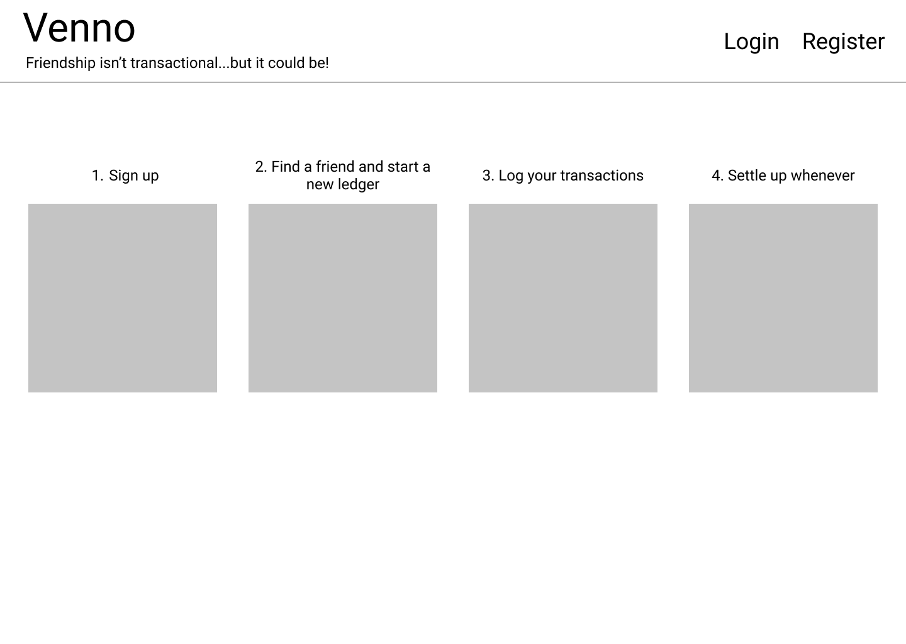
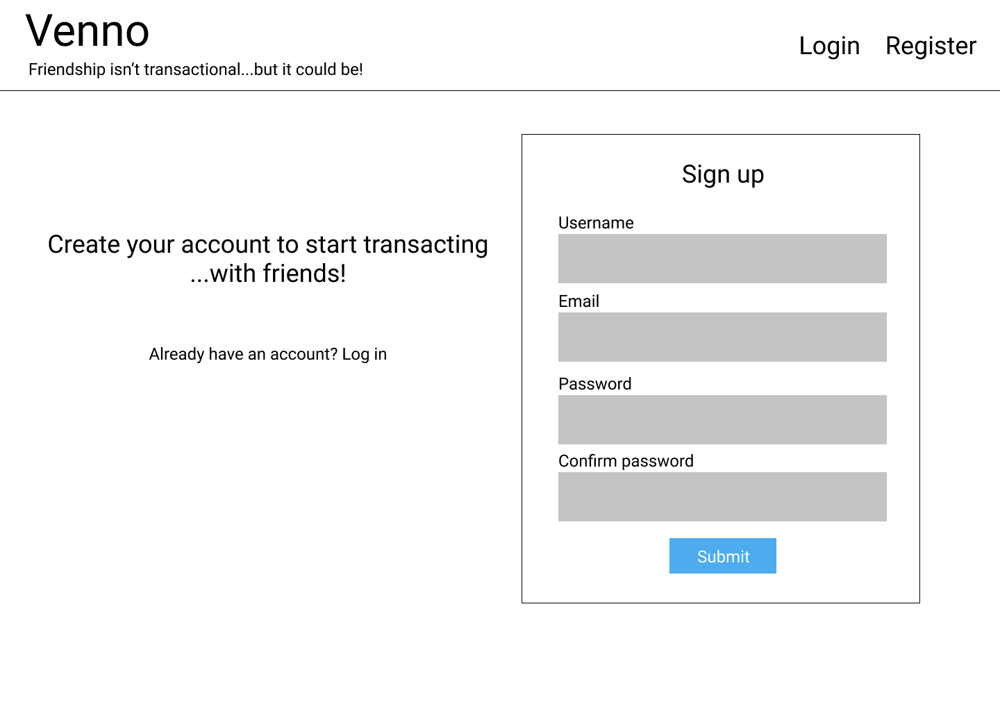
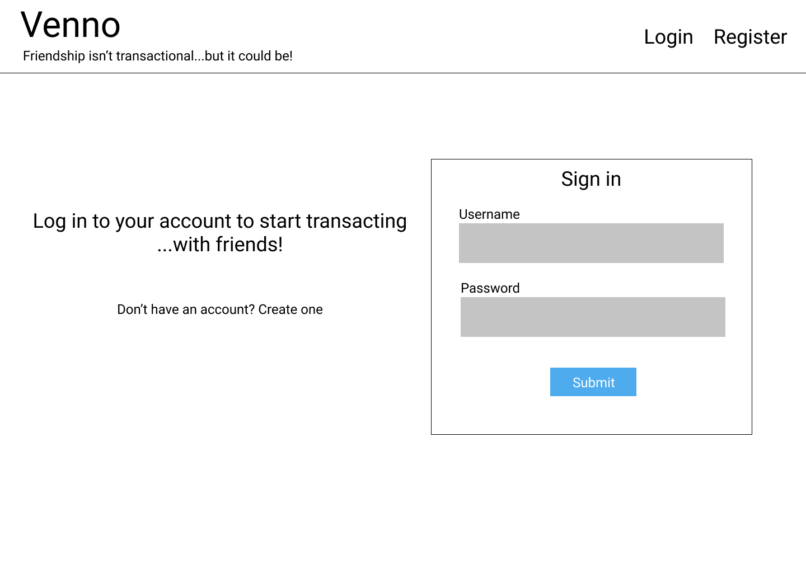
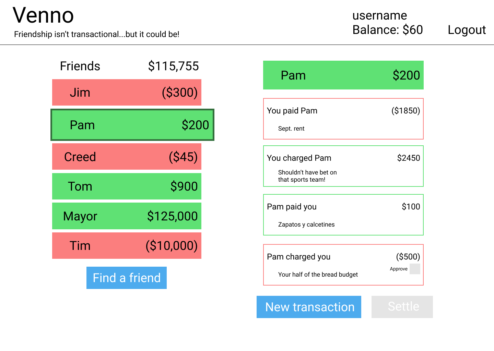
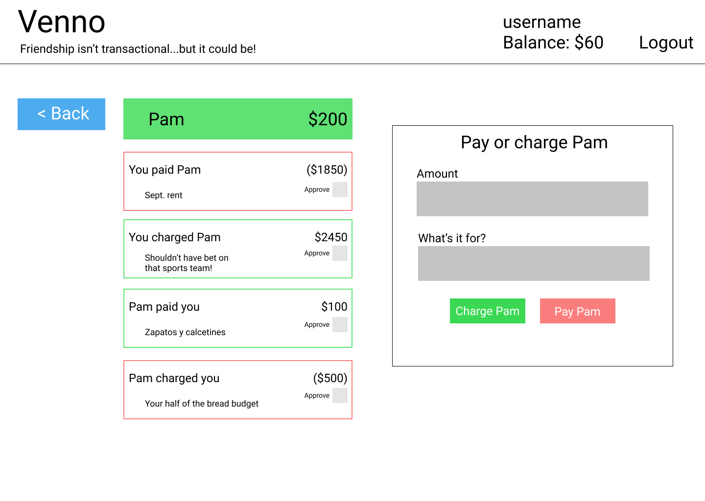
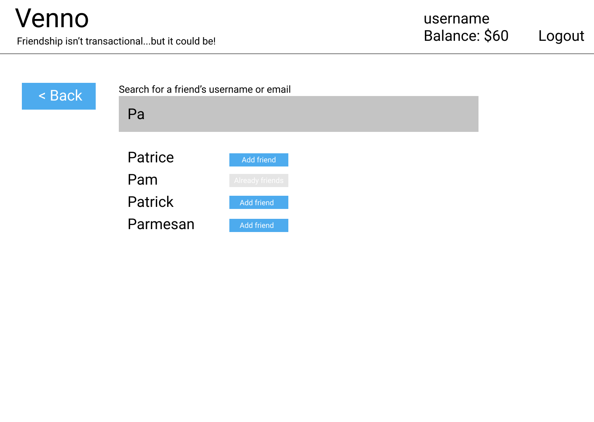

# PROJECT 4 README <!-- omit in toc -->

- [Overview](#overview)
- [MVP](#mvp)
  - [Goals](#goals)
  - [Libraries and Dependencies](#libraries-and-dependencies)
  - [Client (Front End)](#client-front-end)
    - [Wireframes](#wireframes)
    - [Component Tree](#component-tree)
    - [Component Architecture](#component-architecture)
    - [Time Estimates](#time-estimates)
  - [Server (Back End)](#server-back-end)
    - [ERD Model](#erd-model)
- [Post-MVP](#post-mvp)
- [Code Showcase](#code-showcase)
- [Code Issues & Resolutions](#code-issues--resolutions)

<br>

## Overview

**Venno** is a way for friends to keep a ledger of financial transactions between each other without needing to immediately pay and receive money every time. Think of it like opening a tab with your buddy. They got dinner last weekend, you bought drinks at the game, and you'll owe them for the wedding on Saturday. Whatever, they know you're good for it.

<br>

## MVP

> The Minimum Viable Product should be a well-planned, easily-communicated product, ensuring that the client's deliverable will be achievable and meet specifications within the time frame estimated.

The **Project Title** MVP will allow users to create and access an account, start ledgers with other users, submit transactions, and settle their ledgers. No money at this point, just an honor system.

<br>

### Goals

- User signup/signin
- Backend supporting users, accounts, ledgers, and transactions
- Users can find other users
- Users can approve charges from other users
- Users can see outstanding transactions for each ledger

<br>

### Libraries and Dependencies

|   Library    | Description                                          |
| :----------: | :--------------------------------------------------- |
|    React     | _Frontend components and storing state._             |
| React Router | _Frontend routing among different screens._          |
|     Ruby     | _Backend logic._                                     |
|    Rails     | _Backend database setup and schema/model framework._ |

<br>

### Client (Front End)

#### Wireframes

> Use the Wireframes section to display desktop, tablet and mobile views. No hand-drawn wireframes. Use a tool like wireframe.cc, Whimsical or AdobeXD



- Desktop landing



- Sign up



- Sign in



- User landing



- New transaction



- Find friend

#### Component Tree

[Component tree](readme-assets/Venno-component-hierarchy.png)

#### Component Architecture

> Use this section to define your React components and the data architecture of your app. This should be a reflection of how you expect your directory/file tree to look like.

```structure

src
|__ assets/
      |__ fonts
      |__ graphics
      |__ images
      |__ mockups
|__ components/
      |__ Header.jsx
|__ services/

```

#### Time Estimates

> Use this section to estimate the time necessary to build out each of the components you've described above.

| Task                            | Priority | Estimated Time | Time Invested | Actual Time |
| ------------------------------- | :------: | :------------: | :-----------: | :---------: |
| Proposal/approval               |    H     |     3 hrs      |     3 hrs     |    3 hrs    |
| Create backend and seed         |    H     |     1 hrs      |      hrs      |     hrs     |
| Build CRUD functionality        |    H     |     4 hrs      |      hrs      |     hrs     |
| Test API endpoints              |    H     |     1 hrs      |      hrs      |     hrs     |
| Build auth functionality        |    H     |     2 hrs      |      hrs      |     hrs     |
| Create React app                |    H     |     1 hrs      |      hrs      |     hrs     |
| Test frontend API functionality |    H     |     1 hrs      |      hrs      |     hrs     |
| Home screen                     |    H     |     3 hrs      |      hrs      |     hrs     |
| Signin/signup screens           |    H     |     3 hrs      |      hrs      |     hrs     |
| Ledgers component               |    H     |     2 hrs      |      hrs      |     hrs     |
| Ledger detail component         |    H     |     2 hrs      |      hrs      |     hrs     |
| User landing screen             |    H     |     2 hrs      |      hrs      |     hrs     |
| New transaction screen          |    H     |     2 hrs      |      hrs      |     hrs     |
| Find friend screen              |    H     |     3 hrs      |      hrs      |     hrs     |
| CSS styling                     |    H     |     6 hrs      |      hrs      |     hrs     |
| TOTAL                           |          |     36 hrs     |     3 hrs     |     TBD     |

<br>

### Server (Back End)

#### ERD Model

[ERD](readme-assets/Venno-ERD.png)
<br>

---

## Post-MVP

- Better styling
- Figure out how money works
- Public/private feed of txns
- Reactions/comments
- Profile pics
- Txn history and reporting

---

## Code Showcase

> Coming soon

## Code Issues & Resolutions

> Coming soon
